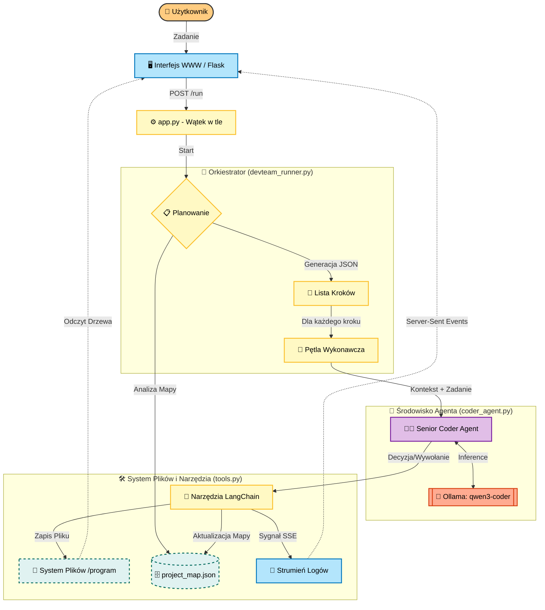

# AI Agent 
## Spis treśći 
 * [Koncept](#koncept)
---

  
Koncept

  
# 🚀 Koncept Sieci Agentów Programistycznych (DevTeam)

## 💡 Diagram Architektury Mermaid

```mermaid
graph TD
    %% --- Style ---
    classDef actor fill:#ffcc80,stroke:#333,stroke-width:2px,color:#000;
    classDef ui fill:#b3e5fc,stroke:#0277bd,stroke-width:2px,color:#000;
    classDef logic fill:#fff9c4,stroke:#fbc02d,stroke-width:2px,color:#000;
    classDef storage fill:#e0f2f1,stroke:#00695c,stroke-width:2px,stroke-dasharray: 5 5,color:#000;
    classDef agent fill:#e1bee7,stroke:#7b1fa2,stroke-width:2px,color:#000;
    classDef external fill:#ffab91,stroke:#d84315,stroke-width:2px,color:#000;

    %% --- Węzły ---
    User([👤 Użytkownik]):::actor
    UI[🖥️ Interfejs WWW / Flask]:::ui
    App[⚙️ app.py - Wątek w tle]:::logic
    
    subgraph Orchestrator ["🧠 Orkiestrator (devteam_runner.py)"]
        direction TB
        Planner{📋 Planowanie}:::logic
        Steps[📝 Lista Kroków]:::logic
        Loop[🔄 Pętla Wykonawcza]:::logic
    end
    
    subgraph AgentEnv ["🤖 Środowisko Agenta (coder_agent.py)"]
        direction TB
        Coder[👨‍💻 Senior Coder Agent]:::agent
        Ollama[[🦙 Ollama: qwen3-coder]]:::external
    end
    
    subgraph ToolsSystem ["🛠️ System Plików i Narzędzia (tools.py)"]
        direction TB
        Tools[🧰 Narzędzia LangChain]:::logic
        FS[📂 System Plików /program]:::storage
        KB[(🗄️ project_map.json)]:::storage
        LogStream[📡 Strumień Logów]:::ui
    end

    %% --- Połączenia ---
    User -->|Zadanie| UI
    UI -->|POST /run| App
    App -->|Start| Planner
    
    Planner -->|Analiza Mapy| KB
    Planner -->|Generacja JSON| Steps
    Steps -->|Dla każdego kroku| Loop
    
    Loop -->|Kontekst + Zadanie| Coder
    Coder <-->|Inference| Ollama
    
    Coder -->|Decyzja/Wywołanie| Tools
    
    Tools -->|Zapis Pliku| FS
    Tools -->|Aktualizacja Mapy| KB
    Tools -->|Sygnał SSE| LogStream
    
    LogStream -.->|Server-Sent Events| UI
    FS -.->|Odczyt Drzewa| UI

```

---
