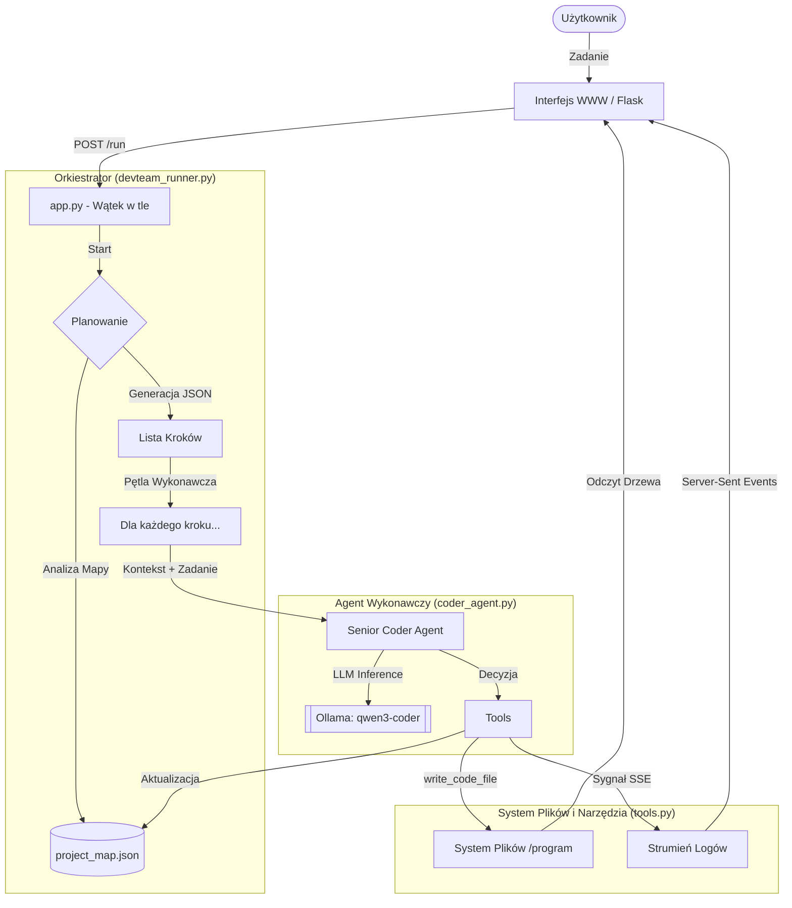

# AI Agent 
## Spis treśći 
 * [Koncept](#koncept)
---

  
Koncept

  
# 🚀 Koncept Sieci Agentów Programistycznych (DevTeam)

## 💡 Diagram Architektury Mermaid

```mermaid
graph TD
    User([Użytkownik]) -->|Zadanie| UI[Interfejs WWW / Flask]
    UI -->|POST /run| App[app.py - Wątek w tle]
    
    subgraph "Orkiestrator (devteam_runner.py)"
        App -->|Start| Planner{Planowanie}
        Planner -->|Analiza Mapy| KB[(project_map.json)]
        Planner -->|Generacja JSON| Steps[Lista Kroków]
        
        Steps -->|Pętla Wykonawcza| Loop[Dla każdego kroku...]
    end
    
    subgraph "Agent Wykonawczy (coder_agent.py)"
        Loop -->|Kontekst + Zadanie| Coder[Senior Coder Agent]
        Coder -->|LLM Inference| Ollama[[Ollama: qwen3-coder]]
        
        Coder -->|Decyzja| Tools
    end
    
    subgraph "System Plików i Narzędzia (tools.py)"
        Tools -->|write_code_file| FS[System Plików /program]
        Tools -->|Aktualizacja| KB
        Tools -->|Sygnał SSE| LogStream[Strumień Logów]
    end
    
    LogStream -->|Server-Sent Events| UI
    FS -->|Odczyt Drzewa| UI

```

---
